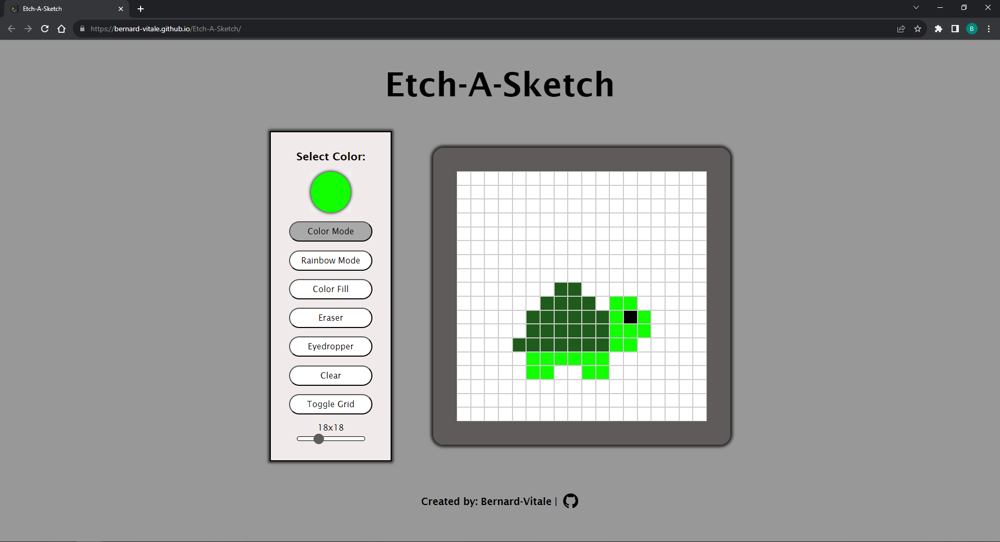

# Etch-A-Sketch Website

This project is a part of The Odin Project's curriculum. You can find the information about this specific assignment here:
- [Etch-a-Sketch Assignment](https://www.theodinproject.com/lessons/foundations-etch-a-sketch)

This website allows you to:
- Select any color you want to draw with.
- Use "Rainbow Mode", which randomizes the color of every pixel you draw.
- Use "Color Fill" to change the color of every pixel to the selected color.
- Use an Eraser to erase the pixels you have already drawn.
- Use an Eye Dropper Tool, to select the exact color of a pixel that is on the drawing.
- Clear the pixel grid completely and have a fresh start.
- Toggle the grid lines on and off.
- Change the size of the grid, from a 5x5 up to a 50x50

[Live Website](https://bernard-vitale.github.io/Etch-A-Sketch/)

Here is a screenshot of the website:
